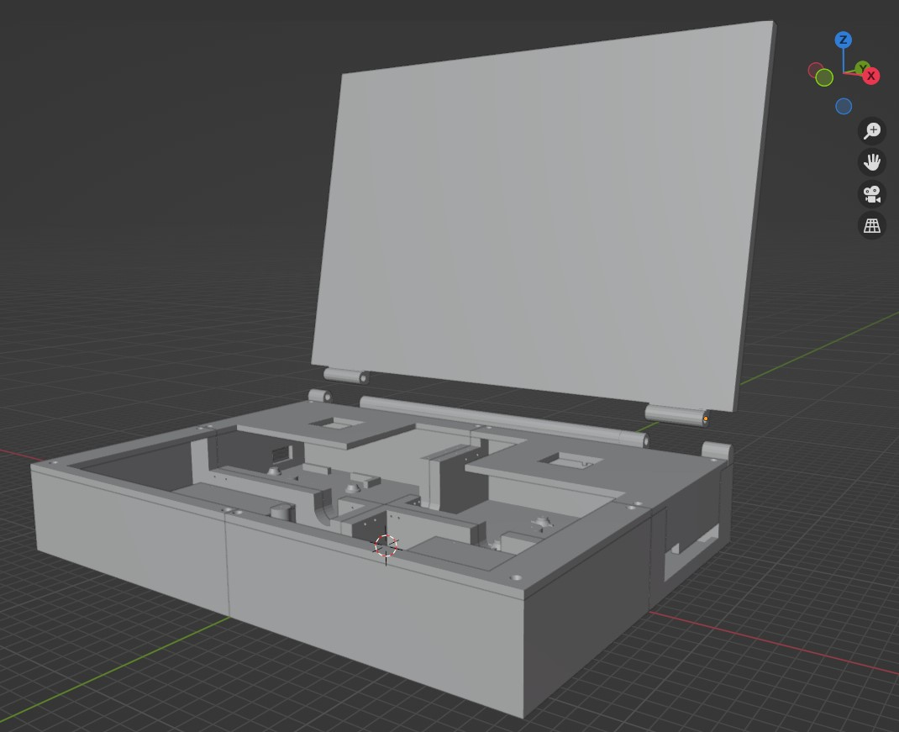

# case-and-design
Balthazar's casing or a housing and the design.

This is the place for CAD and 3D ready-to-print files and design proposals.
We encourage you to adopt casing openings to a certain SoM (systems on a Module) and outputs.
Those files will be updated as we move on and as revisions change to a final look and also materials will vary.
About the file formats - well..the truth is following.
The issues we are encountering and it is as it might be
somewhat problematic with Open Source software. 
CAD is complicated on Linux, as it is a big
business - and we must fight for it to be more open.

However to be more professional in that both directions we try to be reluctantly compliant, 
balancing between the industry and our community. 

You can watch .dxf files only with Autocad software and also on your mobile 
device with few dedicated apps. 
Dwg files you can watch also with Adobe programs, but because they are
basically all just drawings they will be shown as 2d drawings then. 
Only in Autocad you can see them as 3D objects. 
So you see the dxf files but if you have no Autocad, you can not do anything with them.
Bummer that is and out of our reach right now.

